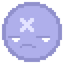
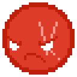
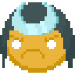
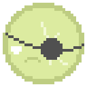
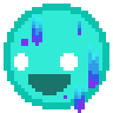
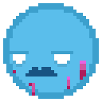
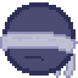
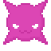

# PILLUP! 💊

[TÉLÉCHARGER L'APK](https://github.com/osef-art/play-pillup/raw/main/KAPS.apk) 📥👈🏾  
~ ~ ~   
[CHECKER LA PAGE ITCH.IO](https://osef-ptn.itch.io/pillup) 🏪

yo.  
très fier de pouvoir vous montrer mon tout premier **jeu mobile** *"KAPS"* (aujourd'hui "PILLUP"), que
j'ai codé et dessiné de A à Z avec [Unity](https://unity.com/). j'ai commencé à
taffer dessus fin juin 2022, depuis j'ai pas arrêté de poncer le truc, 7j/7,
comme si les gens allaient le télécharger tsais 🤡

**j'explique le principe:** c'est un jeu à la *'Dr. Mario'* pour ceux qui ont la
ref. pour ceux qui voient pas, disons que ça ressemble un peu à Tetris. des
pilules 💊 vont tomber dans une grille truffée de microbes 👾. le but est de
faire des combinaisons (des *matchs*) de la même couleur pour virer tous les
microbes de la grille façon Pfizer. ✨  
ça a l'air assez chill dit comme ça. sauf que les pilules **accélèrent** ⏳ au
fur et à mesure, les grilles deviennent de plus en plus **chargées** en
microbes, y'en a qui vont commencer à avoir des **pouvoir spéciaux** 💥, sans
parler des **sidekicks** 🤝 qui t'aideront à travers les niveaux et qui eux
aussi possèdent chacun leur propre **pouvoir** 🧪, je te cache pas que le
résultat est assez fun. bourré de bugs, mais fun.

  

⚠ il s'agit d'une **version alpha** du jeu, c'est à dire qu'il y a pas mal de
trucs qui manquent, de trucs qui buggent un peu, de trucs temporaires qui vont
être remplacés par des trucs mieux, du coup soyez pas surpris si parfois y'a des
comportements bizarres. 😬  
*(ah oui et ceux qui sont sur iOS.... bon au moins vous avez la santé* 🤡)

bon il est probable que je parle beaucoup, du coup je te propose un petit menu
avec toutes les infos sur le jeu dont j'aimerais faire part. clique sur celle(s)
qui t'intéresse(nt)

[📱 EH COMMENT ON TÉLÉCHARGE LE JEU ??](#lancer-le-jeu-)  
[🎮 EH COMMENT ON JOUE ??????](#comment-jouer-)  
[📜 EH C'EST QUOI LES RÈGLES (j'arrête)](#rgles-du-jeu-)  
~  
[🚨 DERNIÈRES UPDATES](#updates-)  
[👨🏾‍💻 CE SUR QUOI JE TAF EN CE MOMENT](#devlog-)  
[🎯 LES IDÉES / OBJECTIFS SUR CE PROJET](#objectifs-)  
[💀 BUGS CONNUS (donc venez pas me harceler)](#bugs-)  
~  
[🤝 LES SIDEKICKS](#sidekicks-)  
[👾 LES MICROBES](#microbes-)  
[💊 PILULES SPÉCIALES](#pilules-spciales-)

## LANCER LE JEU 📱

Si tu es sur Android, clique vite
👉🏾 [ICI](https://github.com/osef-art/play-kaps/raw/main/KAPS.apk) 👈🏾 !!
Ca va direct télécharger une `.apk` te permettant d'installer le jeu sur ton
tel.  
Si tu es sur iPhone, tu pourras toujours regarder tes potes sur Android s'amuser
🙏🏾  
Si tu es sur un ordi, j'ai aucune idée de ce que tu fous là.

  

## RÈGLES DU JEU 📜

*(je vais bientôt rajouter un **tuto** dans le jeu détaillant tout ce que je
vais raconter ici, mais lis quand même on sait jamais.)*

Chaque niveau est une **grille** dont certaines cases sont occupées par des **microbes**
colorés.  
Au fur et à mesure, des **pilules** colorées vont tomber dans la grille et
s'empiler. Le gameplay consiste à réaliser des **combinaisons** de **4 objets**
de la **même couleur** pour détruire ces 4 objets. On appelle ça un **match-4**
. (on appelle pas du tout ça un match4 mais c'est moins long à écrire)

Quand les microbes se retrouvent dans des *matchs*, ils sont **éradiqués**. Le
niveau est complété lorsqu'on a viré **tous les microbes** de la grille.
J'aurais peut-être du appeler le jeu Astrazenekaps. Attends je l'ai dit à voix
haute ?

Le jeu aurait pu s'arrêter là, mais j'ai rajouté pas mal de **mécaniques**
rendant le concept plus
**challengeant** (je hais ce mot):

- Les [**MICROBES**](#microbes-) 👾 vont développer des **pouvoirs spéciaux**,
  y'en a qui pourront se **multiplient**, d'autres**supriment** des pilules de
  la grille, certains nécessiteront **plusieurs coups** pour être éradiqués.
  Plus il y aura de microbes spéciaux, plus il deviendra nécessaire d'élaborer
  des petites **stratégies**
  pour compléter un niveau, genre supprimer tels microbes en priorité, ne pas
  poser de pilules à proximité de certains, etc. Mais la vraie **force** du jeu
  réside dans une mécanique bien plus intéressante

  
  

- Les [**SIDEKICKS**](#sidekicks-) 🤝. Ce sont des *'principes actifs'* qui
  pourront t'aider en cours de partie. Chaque sidekick a sa propre **compétence**, 
  qui pourra être déclenchée **plusieurs fois** pendant le
  niveau.  
  Certains **éradiquent** des microbes, d'autres suppriment des **lignes**,
  des **colonnes**
  et autres **motifs**, certains génèrent des **pilules spéciales**, etc. On
  peut en choisir jusqu'à
  **2** par partie, et certaines équipes possèdent une **synergie** unique.  
  Chaque sidekick possède une **jauge de mana**, vide au début de la partie.
  Lorsqu'<u>un objet de la couleur du sidekick</u> est détruit, il **remplit**
  sa jauge de 1. Quand la jauge est pleine, le sidekick est **prêt**, et sa
  compétence peut être **déclenchée** par le joueur. ⚡ La jauge se vide à chaque
  utilisation de la compétence.  
  Certains sidekicks sont **passifs** 🤖 et se déclenchent **automatiquement**
  après un certain nombre de
  **tours**.

❌ La partie est perdue quand la pile de pilules atteint <u>le haut de la
grille</u>.  
Attention, le jeu devient de plus en plus **rapide** au fur et à mesure de la
partie.

#### MÉCANIQUES AVANCÉES 🧠

- 📥 Le bouton **"HOLD"** sert à **conserver** une capsule dans l'inventaire
  pour pouvoir la
  **ressortir** au moment venu. Elle est échangée avec celle déjà présente dans
  la grille. Il y a des chances que la mécanique devienne payante, plus j'y
  réfléchit et plus je la trouve ultra cheatée.
- 🎊 Lorsque qu'une pilule se sépare ou tombe, on peut **la bouger** ou **bouger
  ses fragments** afin de les déposer ailleurs.  
  Ca peut être très utile pour perpétuer un combo ou juste réaménager la grille.
- 📛 On a vu qu'on pouvait swipe vers le bas pour faire **tomber** une pilule.  
  Ce move génère des **points supplémentaires** et a une faible chance de
  libérer de la **mana**.
- 🎆 Réaliser des ***match-5***, des ***match-6*** ou + génère de la mana et des
  points supplémentaires.  
  Aussi, ces *matchs* font plus de **dégâts** aux microbes qui ont une barre de
  vie.
- 🌡 Enchaîner plusieurs *matchs* d'affilée démarre un **combo**.  
  Plus il est élevé, plus il a de chances de générer de la mana supplémentaires
  à chaque match.
- ⏹ Il est possible de *matcher* des lignes et des colonnes, mais aussi des **carrés 3x3**.  
  C'est très chaud à réaliser, mais encore une fois, c'est particulièrement **récompensant** 
  en terme de mana, de dégâts et de score.

  

## COMMENT JOUER 🎮

*(si tu n'as pas lu l'intro ou [les règles](#rgles-du-jeu-), il est possible que
tu ne comprennes pas grand chose je t'avoue* 💀)  
Pour **bouger** les pilules, sélectionne-les avec ton doigt et déplace-les
librement dans la grille.  
Tu peux aussi les déplacer depuis n'importe quel endroit de l'écran avec le **joystick**.
Tu peux déplacer la pilule vers la **gauche** ⬅, la **droite** ➡, et
le bas ⬇.  
Pour faire **pivoter** une pilule, **tape** 👆 dessus, ou sur n'importe quel
endroit de l'écran.  
💨 MOVE STYLÉ: tu peux **swipe vers le bas** pour faire **tomber** la pilule
super vite. Ca rapporte des points supplémentaires donc hésite pas. 😏

Si le joystick ou le swipe te gênent, tu peux les désactiver à tout moment dans
les **paramètres**. Tu peux même changer le sens dans lequel tourne la pilule
par défaut. Si ça c'est pas magnifique.

Très important aussi, quand tu combines des pilules et qu'elles se cassent, tu
peux aussi bouger les
**fragments** des pilules. C'est un peu compliqué parce qu'elles sont assez
rapides, mais c'est archi rentable.
---

# UPDATES 🚨

**🎢 30/09/22:** J'ai ajouté plein de **nouveaux niveaux**, certains ont été
simplifiés (grille + haute), et j'ai rendu le gameplay beaucoup plus aéré:
décompte en début de partie, pause subtile entre deux pilules, ajustement de
la vitesse et de l'accélération au cours du niveau...

**🇫🇷 29/09/22:** J'ai complètement **traduit** le jeu en anglais et en français.

**📥 25/09/22:** Ajout d'un **système de sauvegarde**. Dîtes-vous qu'avant, 
quand on quittait l'appli et qu'on revenait dessus, il fallait tout reprendre
depuis le début 😭     

**⚙ 23/09/22:** J'ai rajouté dans le menu pause la possibilité d'éditer pas mal de
**paramètres**. Certains sont des utilitaires (volume du son, tremblements
d'écran), mais la plupart sont des paramètres permettant d'ajuster le **gameplay**
(joystick, swipe, rotation par défaut) afin de le rendre + personnalisé pour
chaque joueur.

### FIXS ! 🔨

**05/10/22:** J'ai réglé le fait que quand une capsule se cassait en **fragment(s)**,
on pouvait pas attraper le fragment tout de suite.  
En fait c'était à cause des effets
de score et de mana qui se mettaient devant 😭 merci à #LvLup三Skorpio#7366 grâce à
qui j'ai eu ce flash 🧠  

J'ai aussi un peu corrigé les sidekicks qui pouvaient faire **freeze** la pilule
quand ils se déclenchaient, en vrai c'est surtout du au fait que je voulais que
les pilules arrêtent de descendre quand un sidekick entre en action *(pour qu'on
puisse se concentrer sur la grille et permettre au joueur de souffler un peu)*,
le problème c'est que quand on en déclenche 2 en même temps, ça peut faire des
dingueries 💀 j'ose même pas imaginer ce qui se passe quand on met sur pause
pendant une attaque 💀💀💀💀

d'ailleurs merci à tous les testeurs de l'alpha pour vos retours et vos tests !! ✨
je vais bientôt créer un discord, vous aurez un rôle VIP qui vous permettra
d'obtenir des trucs premium du jeu (quand y'en aura 😭)  
en plus y'en a qui jouent le jeu de fou, avec des screens à l'appui, des scénarios
détaillés et tout 💀 eux c'est accès au paradis direct

## DEVLOG 👨🏾‍💻

- Bon en ce moment j'ai un peu mis en pause le développement du jeu pour me
concentrer à fond sur les feedbacks et la création de pages dédiées, d'ailleurs j'ai
créé une page [itch.io](https://osefwastaken.itch.io/kaps) et un
[discord](https://discord.gg/8HKEnfzaGq), foncez !!
<iframe src="https://discord.com/widget?id=1027019198607659019&theme=dark" width="350" height="500" allowtransparency="true" frameborder="0" sandbox="allow-popups allow-popups-to-escape-sandbox allow-same-origin allow-scripts"></iframe>

## OBJECTIFS 🎯

Ca c'est une liste de features, de *"gros morceaux"* qu'il reste à ajouter
dans le jeu et qui vont demander encore pas mal de semaines de taf:

- **Débloquer les sidekicks au fur et à mesure**. Ca devrait pas être trop
chaud à faire, mais ça va quand même demander un peu de temps, surtout qu'en
vrai j'aimerais faire en sorte que l'ordre de leur apparition soit aléatoire,
en commençant par les moins chauds, puis les plus techniques, et qu'on puisse
décider entre garder le sidekick ou changer sa team.  
J'ai aussi envie de pouvoir faire évoluer les sidekicks, ils gagneraient de l'XP
à chaque fin de partie, et à certains niveaux ils leurs compétences seraient
un peu améliorées (moins de mana/tours pour être déclenchés, tirs plus précis,
plus de dégâts...)
- **Une vraie interface utilisateur.** Là j'ai mis le strict nécessaire et du
coup les visuels sont un peu tristes en vrai. Je bosserai plus tard sur un vrai
menu, une vraie direction artistique, de meilleures icones, etc. je vais peut
être devoir embaucher des gens pour ça donc restez à l'affut 🐀🐀
- **Mettre des animations quand les sidekicks se déclenchent.** Là c'est un peu
vide quand on déclenche un sidekick, on voit juste les cases se supprimer en live,
mais je compte vraiment rajouter une vraie animation des sidekicks qui attaquent
la grille et qui reviennent à leur place après.
- **Mettre un système de monnaie** Je veux qu'on puisse gagner de l'oseille
à chaque fin de niveau, peut être pendant, en débloquant des succès et en
matant des pubs. Cet argent servira à acheter tout ce qui est proposé dans
la **boutique**. Ah bah tiens justement:
- **Ajouter une boutique.** Ce sera un shop dans lequel on pourra acheter des
sidekicks, des skins (oui oui 😏), des bonus pour les niveaux et même de l'XP
pour les sidekicks. Je vais sûrement mettre une monnaie premium aussi, je
pense qu'on pourra acheter que les skins avec, je tiens à ce que mon jeu soit
pas un *pay to win*.
- **Le mode multijoueur.** Bon ça je vous laisse la surprise 😏 je dois déjà
régler tous les problèmes du mode "pas multijoueur" 🥲
- **Mettre des maps pour les niveaux.** Ca aussi c'est un truc qui va prendre
pas mal de temps. En fait j'aimerais que chaque map représente un patient, qui
comportera 20, 25, 30 niveaux. *(nombre à fixer)* Et le fil des niveaux ce sera
un intestin grêle et tout (même d'autres parties du corps ! 👀) Certains patients
vont introduire des mécanismes ou des microbes spécifiques. Le souci avec ça
c'est que ça va demander beaucoup de taf niveau dessins 💀 encore une fois,
restez à l'affût.

- **...** *(bientôt!)*

## BUGS 💀

*(bon ça pas besoin d'attendre)*

- Le sidekick **Shadow** bug de fou, parfois en supprimant une capsule il en
fait tomber d'autres, et du coup celles qui sont dans sa couleur et qui tombent
ne se suppriment pas.  
- Parfois le jeu **freeze** sans aucun motif particulier. Genre on peut même pas
appuyer sur pause. Ca rend ouf.
- Parfois le jeu **freeze** mais on peut quand même mettre sur pause, la plupart
du temps on peut aussi bouger la capsule mais juste elle tombe pas, bon ça pour
le coup je peux corriger mais j'arrive pas à voir comment ça se fait.  
- Quand on dépose plusieurs capsules/fragements sur la même colonne et qu'elles
sont superposées, parfois y'en a qui fusionnent au lieu de s'empiler :/ assez galère
à corriger mais à voir

---

## SIDEKICKS 🤜‍🤛

| Nom | | Mana | Dégâts | Compétence |  
|---:|:---:|:---:|:---:|:---|   
| (✨nouv.!) **CROSS**    |  | 12       |   | Supprime une croix ("X") autour d'un objet
| (✨nouv.!) **SHUFFLER** |  |  8       |   | Mélange les couleurs des pilules de la grille
| **MARKSMAN**            |  | 25       | 1 | Tranche deux diagonales
| **MOSES**               |  | 25       | 2 | Tranche toute une colonne au hasard
| **SNIPER**              |  | 15       | 3 | Tire sur le microbe avec le plus de PV
| (✨nouv.!) **SAMURAI**  |  | 15       | 1 | Tranche une diagonale au hasard
| **BOMBER**              |  | 13 tours | 1 | Génère une pilule explosive
| **MIMAPS**              |  | 15       | 2 | Brûle 3 objets de la grille au hasard
| (✨nouv.!) **CUTTER**   |  | 18       | 2 | Découpe un segment vertical de 3 cases, puis un horizontal
| **UNI**                 |  |  4 tours |   | Génère une pilule uniforme
| **PAINTER**             |  | 10       |   | Repeint 6 pilules de la grille dans la couleur de son allié
| **BUTCHER**             |  | 20       | 2 | Tranche 2 microbes aux hasard
| **SHOCKWAVE**           |  | 20       | 2 | Frappe un objet et ses cases adjacentes
| **SLICER**              |  | 20       | 1 | Tranche une ligne avec au moins un objet dessus
| (✨nouv.!) **SHADOW**   |  | 10 tours | 1 | Supprime toutes les pilules de sa couleur
| **? ? ?**               |  | 12       |   | Gèle définitivement un microbe avec un cooldown
| **? ? ?**               |  | 16       |   | Copie la compétence de son allié; s'il est tout seul, lance une attaque au hasard !

## MICROBES 🦠

| Nom | | Cooldown | Compétence |  
|---:|:---:|:---:|:---|   
| **BASIC** |  | - | "ah gros on est là hein"
| **BLOCK** |  | - | Nécessite plusieurs coups (4 max.) pour être détruit
| **VIRUS** |  | 8 | Transforme une pilule de la grille au hasard en virus
| **SPIKE** |  | 5 | Détruit une pilule adjacente au hasard
| **? ? ?** | *(Ca arrive !)* | 6  | Peut soigner un **BLOCK** (1PV), ou transformer un microbe **BASIC** en **BLOCK**
| **? ? ?** | *(Ca arrive !)* | 6  | Échange de place avec la pilule la plus proche
| **? ? ?** | *(Ca arrive !)* | 6  | Change sa propre couleur. comme ça.
| **? ? ?** | *(Ca arrive !)* | 10 | Émet de la fumée devant un objet, masquant sa couleur. (peut être dissipé au contact, ou si l'émetteur est détruit)
| **? ? ?** | *(Ca arrive !)* | -  | Rend un microbe invulnérable. Le bouclier disparaît quand (???) est détruit.
| **(egg)** | *(Ca arrive !)* | -  | Contient un microbe **BASIC** d'une autre couleur visible par le joueur

## PILULES SPÉCIALES ✨💊

| Nom | | Effet |  
|---:|:---:|:---|   
| **EXPLOSIVE**  |  | Explose quand elle est détruite, brûlant toutes les cases autour d'elle
| **JOKER**      | *(Ca arrive !)* | Peut être matchée avec n'importe quelle autre couleur
| **(missile?)** | *(Ca arrive !)* | Une fois détruite, vise un microbe au hasard

---

  

